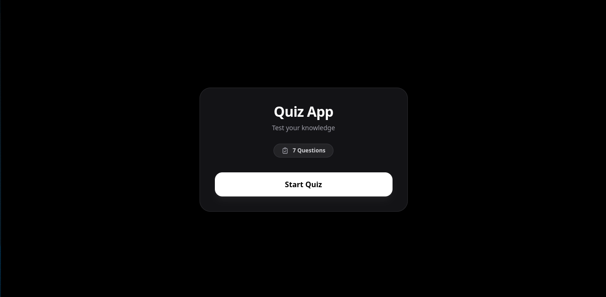

# ⚡ Minimal Dark Quiz App

A sleek, responsive, and lightweight Quiz Application built with **Vanilla JavaScript**, **HTML5**, and **Tailwind CSS**. Features a modern dark-mode glassmorphism interface with dynamic state rendering and score tracking.



---

## ✨ Features

- 🌙 **Dark Glassmorphism UI**: High-contrast, minimal dark mode designed with Tailwind CSS.
- ⚡ **Zero Framework Dependencies**: Pure Vanilla JS for DOM manipulation and state management.
- 📱 **Fully Responsive**: Optimized for desktop, tablet, and mobile displays.
- 📊 **Real-time Score Calculation**: Dynamic score tracking with penalty for wrong answers.
- 🛡️ **HTML Escaping Support**: Properly renders special HTML characters/entities inside questions without layout breaks.
- 🔄 **Restart Mechanism**: Quick restart option to refresh state and replay the quiz instantly.

---

## 🛠️ Tech Stack

- **HTML5**: Semantic document structure.
- **Tailwind CSS**: Utility-first CSS framework for styling.
- **Vanilla JavaScript (ES6+)**: Dynamic UI updates and state management.

---

## 📁 Project Structure

```text
quiz-app/
├── assets/
│   ├── js/
│   │   └── app.js        # Main application logic & quiz dataset
│   └── style/
│       ├── input.css     # Tailwind CSS source file
│       └── output.css    # Compiled CSS stylesheet
├── index.html            # Main HTML document
├── tailwind.config.js    # Tailwind configuration
└── README.md             # Project documentation